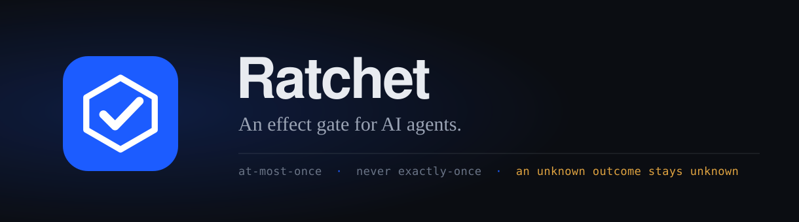

<h1 align="center">
  
</h1>

[](https://github.com/thearchitect0x-glitch/ratchet/actions/workflows/ci.yml)
[](https://github.com/thearchitect0x-glitch/ratchet/actions/workflows/codeql.yml)
[](https://www.npmjs.com/package/ratchet-mcp)
[](LICENSE)
[](https://scorecard.dev/viewer/?uri=github.com/thearchitect0x-glitch/ratchet)
[](https://www.bestpractices.dev/projects/14440)
[](docs/SSDF.md)
[](https://api.reuse.software/info/github.com/thearchitect0x-glitch/ratchet)

**An effect gate for AI agents.** Your agent asks before it does anything it cannot take back —
charge a card, ship a deploy, publish a package, send the email — and gets a durable decision, so
the same real-world action is attempted at most once across crashes and retries. Agents can also
read back what a run already did, and spend against a limit they cannot raise.

Agents retry. LLM control flow is non-deterministic, network calls fail ambiguously, and processes
die mid-action. The result is duplicate emails, double charges, and repeated writes — and nothing
in the stack knows which. Vendor idempotency keys help for the few vendors that offer them, and
never across separate agent processes or model providers.

Ratchet does not execute your actions. It holds a durable decision record in front of them.

```
POST /v1/effects/begin  →  decision: execute | duplicate | in_flight
                                    | blocked | approval_required | denied
```

Only `execute` authorises the caller to act.

---


## Project documents

| | |
|---|---|
| [Architecture](docs/handoff/ARCHITECTURE.md) | High-level design — what the gate is and what it deliberately is not |
| [Assurance case](ASSURANCE_CASE.md) | Threat model, trust boundaries, and the argument for each security requirement — including what is *not* defended |
| [Roadmap](ROADMAP.md) | What the next year holds, and what will never be built |
| [Governance](GOVERNANCE.md) | Who decides, and what happens if they stop |
| [Contributing](CONTRIBUTING.md) | How to report a bug or propose a change |
| [Security policy](SECURITY.md) | How to report a vulnerability, and how fast you hear back |
| [Code of conduct](CODE_OF_CONDUCT.md) | What is expected, and who to tell |
| [Known limitations](docs/handoff/KNOWN_LIMITATIONS.md) | Everything that is not true yet, stated plainly |

## The part that matters

If your process dies between "go" and "done", most systems quietly let the next caller retry.
Ratchet won't. The lease expires and the effect becomes **`indeterminate`** — a known unknown,
surfaced instead of buried. What happens next is the policy you declared for that effect type:

| `on_indeterminate` | Behaviour | Use for |
|---|---|---|
| `block` (default) | No automatic retry. A human or verifying agent resolves it. | Anything irreversible |
| `retry` | A fresh attempt is granted, up to `max_attempts`. | Vendors that are genuinely idempotent |
| `probe` | Caller must verify at the vendor and record evidence first. | Charges, transfers, payouts |

Exactly-once delivery is not achievable in a distributed system and this project does not claim it.
What Ratchet guarantees is **at-most-once initiation**, a recorded outcome that later callers
replay, and an explicit state for the case nobody else admits exists.

---

## Quick start

Requirements: Node 20.11+, Docker (for local Postgres).

```bash
npm install
cp .env.example .env          # defaults work for local development
npm run dev:db                # Postgres on :5433 via Docker
npm run migrate
npm run dev                   # control plane on :8787
npm run dev:worker            # lease reaper + webhook delivery (separate terminal)
```

Then open <http://localhost:8787>, or drive it from the shell:

```bash
bash examples/curl/walkthrough.sh
```

`npm run seed` populates a workspace with realistic state — a completed effect, a duplicate, an
indeterminate one, and one awaiting approval — so the console has something to show.

### Or with Docker Compose

```bash
AUTH_SECRET=$(openssl rand -base64 32) docker compose up --build
```

---

## The core loop

```bash
# 1. Ask, before you act.
curl -X POST http://localhost:8787/v1/effects/begin \
  -H "Authorization: Bearer $RATCHET_API_KEY" \
  -H "Content-Type: application/json" \
  -d '{
    "effect_type": "email.send",
    "idempotency_key": "welcome:user_123",
    "payload": { "to": "sam@example.com" },
    "estimated_cost_micros": 800
  }'
# → { "decision": "execute", "effect_id": "eff_...", "lease_token": "lt_..." }

# 2. Do the real thing, yourself. Ratchet never touches it.

# 3. Say what happened.
curl -X POST http://localhost:8787/v1/effects/eff_.../report \
  -H "Authorization: Bearer $RATCHET_API_KEY" \
  -H "Content-Type: application/json" \
  -d '{ "lease_token": "lt_...", "outcome": "succeeded",
        "result": { "message_id": "msg_9f2" } }'

# Any later caller with the same key now gets:
# → { "decision": "duplicate", "result": { "message_id": "msg_9f2" } }
```

**The one rule:** report `failed` only when you *know* the action did not reach the outside world.
If you are unsure — a timeout, a dropped connection — report nothing. The lease lapses and Ratchet
records an honest `indeterminate`. A false `failed` is worse than silence, because it licenses a
duplicate.

### Idempotency keys

Derive the key from the work, deterministically.

| Good | Broken |
|---|---|
| `welcome-email:user_123` | `uuid4()` |
| `invoice:2026-08:acct_88123` | `"send-" + Date.now()` |
| `pr:acme/api:feature-auth` | `f"job-{attempt_number}"` |

A key that changes on every attempt makes every retry look like new work.

---

## When Ratchet is unreachable

Ratchet sits in your critical path, so decide this before integrating: on an outage your agent
either **acts without the gate** (fail-open) or **refuses to act** (fail-closed). Use fail-closed
for anything you would have to apologise for; fail-open where the vendor deduplicates anyway.

Full contract, client patterns, and the honest availability posture:
[`docs/FAILURE_MODES.md`](docs/FAILURE_MODES.md).

## Architecture

```
                    ┌──────────────────────────────┐
  agents ──────────▶│  control plane (stateless)   │
  REST + MCP        │  Fastify · /v1 · /mcp · web  │
                    └──────────────┬───────────────┘
                                   │
                    ┌──────────────▼───────────────┐
                    │  Postgres                    │
                    │  effects · policies · ledger │
                    │  spend windows · audit       │
                    └──────────────▲───────────────┘
                                   │
                    ┌──────────────┴───────────────┐
  webhooks ◀────────│  worker (long-running)       │
                    │  lease reaper · delivery · GC│
                    └──────────────────────────────┘
```

The control plane is stateless and scales horizontally — it may run on serverless infrastructure.
**The worker may not.** It expires leases on a timer whether or not a request is in flight; a
serverless function cannot do that. Run it as a long-running container. Multiple replicas are safe
(every claim uses `FOR UPDATE SKIP LOCKED`).

At-most-once is enforced by a database unique constraint on
`(workspace_id, effect_type, idempotency_key)` — not by application logic.

Full detail: [`docs/handoff/ARCHITECTURE.md`](docs/handoff/ARCHITECTURE.md).

---

## Deploying

The control plane is stateless and can scale freely. **The worker cannot** — it expires leases on a
timer whether or not a request arrives, so it must be a long-running process. That single
constraint rules out purely serverless hosts (Vercel, Netlify functions) despite their being
easier, and is why `fly.toml` runs both process groups from one image.

```bash
brew install flyctl && fly auth login   # once, needs your browser
npm run deploy:fly
```

The script is idempotent: it creates the app, provisions managed Postgres, generates `AUTH_SECRET`
once (never rotating it, since that would invalidate every API key), deploys both processes, and
verifies readiness. It refuses to proceed unless preflight passes:

```bash
npm run deploy:preflight
```

Preflight runs the full suite and production build, then checks that `AUTH_SECRET` is strong and
not the dev default, `PUBLIC_URL` is set (otherwise the manifest would advertise `localhost`),
`RATE_LIMIT_OVERRIDE` is unset, private-network webhooks are off, CORS carries no wildcard, and —
if Stripe is selected — that both the key and the webhook secret are present. It prints no secret
values.

Any container platform works; only `fly.toml` is Fly-specific. Set `DATABASE_URL`, `AUTH_SECRET`,
`PUBLIC_URL`, `NODE_ENV=production`, then run `node dist/api/server.js` (scale freely) and
`node dist/worker/main.js` (at least one, always on).

To rehearse the exact production containers locally:

```bash
AUTH_SECRET=$(openssl rand -base64 32) docker compose up --build
```

## Commands

| Command | What it does |
|---|---|
| `npm run dev` | Control plane with reload |
| `npm run dev:worker` | Worker with reload |
| `npm run dev:db` / `dev:db:down` | Local Postgres in Docker |
| `npm run migrate` | Apply migrations (advisory-locked; safe to run concurrently) |
| `npm run seed` | Populate a workspace with realistic state |
| `npm test` | Typecheck + unit + integration + e2e against a disposable database |
| `npm run test:unit` / `test:integration` / `test:e2e` | One layer |
| `npm run typecheck` / `lint` | TypeScript in strict mode |
| `npm run build` | Compile to `dist/` |
| `npm start` / `start:worker` | Run the compiled build |
| `npm run mcp:stdio` | MCP server over stdio |
| `npm run openapi` | Write the OpenAPI document to disk |
| `npm run deploy:preflight` | Verify the build and configuration are safe to deploy |
| `npm run deploy:fly` | Deploy control plane, worker, and database to Fly.io |
| `npm run metrics` | Operating metrics against the pricing-review thresholds |
| `npm run stripe:check` | Report payment configuration and verify it against Stripe |
| `npm run stripe:listen` | Forward Stripe events to a local instance and print a webhook secret |
| `npm run audit` | Production dependency audit |

---

## Environment

Every variable, with defaults and safety notes, is in [`.env.example`](.env.example). The two that
are required:

| Variable | Notes |
|---|---|
| `DATABASE_URL` | Postgres connection string |
| `AUTH_SECRET` | 32+ random characters. Derives the API-key pepper and console session ids. **Rotating it invalidates every API key and session.** |

In `NODE_ENV=production` the process **refuses to start** if `AUTH_SECRET` is the development
default or shorter than 32 characters, if `CORS_ORIGINS` contains `*`, or if
`WEBHOOK_ALLOW_PRIVATE_NETWORK` is on.

---

## For agents

| Surface | Path |
|---|---|
| OpenAPI 3.1 | `/openapi.json` — generated from the schemas the routes validate against |
| Capability manifest | `/.well-known/agent-manifest.json` — including what Ratchet *doesn't* do |
| Machine docs | `/llms.txt` |
| MCP tool schemas | `/mcp/info` |
| MCP (Streamable HTTP) | `POST /mcp` with `Authorization: Bearer <key>` |
| MCP (stdio) | `npx -y ratchet-mcp` with `RATCHET_API_KEY` — see [`packages/ratchet-mcp`](packages/ratchet-mcp) |

Seven MCP tools: `ratchet_begin_effect`, `ratchet_report_effect`, `ratchet_get_effect`,
`ratchet_resolve_effect`, `ratchet_list_effects`, `ratchet_get_policy`, `ratchet_get_usage`.

Ready-to-use configs and code: [`examples/`](examples/) — Python, TypeScript, curl, Claude Desktop,
Cursor, and generic MCP over HTTP.

---

## Security posture

- Only a **SHA-256 fingerprint** of your payload is stored — never the payload itself.
- API keys are stored as **HMAC-SHA256 peppered with a server secret**; a database leak alone
  yields no usable key. Comparison is constant-time and runs even for unknown prefixes.
- Every query is **workspace-scoped**; a cross-tenant lookup returns `404`, never a hint.
- **SSRF defence in two layers**: static URL validation, then DNS re-resolution with the socket
  **pinned** to the checked address on every delivery attempt. Redirects are never followed.
- Agent-supplied text is **data, never instructions**. Decisions come from stored policy and
  database state — nothing in a payload can widen a scope, raise a budget, or change a policy.
- Unknown request fields are **rejected**, not silently dropped.

No third-party audit has been performed. There is no SOC 2 report and no penetration test.
Details and threat model: [`docs/handoff/SECURITY_REVIEW.md`](docs/handoff/SECURITY_REVIEW.md).

---

## Pricing

One meter: a **gated effect** — the first `begin` for a given `(effect_type, idempotency_key)`.
Duplicate suppression, in-flight checks, retries, reports, reads, policy changes, and webhooks are
all free. You are never charged for the retry behaviour the product exists to absorb.

| Plan | Price | Included effects/mo | Overage |
|---|---|---|---|
| Free | $0 | 1,000 | $1.50 / 1,000, prepaid credit only |
| Pro | $29/mo | 25,000 | $1.50 / 1,000 |
| Custom | contact | above 250,000 | negotiated |

Free stops at its allowance unless you load prepaid credit; there is no automatic overage and no
invoice. Past roughly 19,300 effects a month, Pro is cheaper than paying credit on Free, so the
upgrade is arithmetic rather than a wall.

Two plans, not three: three tiers assert knowledge of three customer segments, and there is no
usage history yet to support one. See
[`docs/handoff/PRICING_AND_DISTRIBUTION_REVIEW.md`](docs/handoff/PRICING_AND_DISTRIBUTION_REVIEW.md)
for the reasoning, including why the previous ladder priced a 20x usage range at one number.

Overage draws from prepaid credit, so a runaway agent stops at your balance rather than generating
an invoice. Cost model and assumptions:
[`docs/handoff/PRICING_AND_UNIT_ECONOMICS.md`](docs/handoff/PRICING_AND_UNIT_ECONOMICS.md).

### Payments

Stripe is fully wired: `startCheckout` creates real Checkout Sessions, and the signed
`checkout.session.completed` webhook credits the ledger. Card details are entered on Stripe's own
page and never reach Ratchet, and credit is applied **only** on the signed webhook — never on the
browser returning to a success URL.

Both `STRIPE_SECRET_KEY` and `STRIPE_WEBHOOK_SECRET` are required before checkout opens. A key
alone selects Stripe but keeps checkout closed: taking a payment that cannot be confirmed would
leave a customer charged and uncredited. Run `npm run stripe:check` to see exactly what is
configured (it prints no secret values).

For local development, get a webhook secret without a public URL:

```bash
npm run stripe:listen     # prints whsec_… ; put it in .env and restart
```

Most of Stripe's onboarding checklist does not apply. Ratchet builds line items inline and never
reads your Stripe catalog, so there is **no product to create**; it does not use Stripe Invoicing;
and it creates Checkout Sessions through the API, not the no-code builder. What does matter before
live payments: **verify your account** (Stripe's KYC), create a **webhook endpoint** pointing at
your deployed `/v1/billing/webhook/stripe` and use *that* endpoint's signing secret in production,
and decide whether you need **tax collection** (`STRIPE_AUTOMATIC_TAX`, off by default).

With no Stripe credentials at all, the built-in test adapter runs instead: no card is charged and
no external request is made. Verified so far in **Stripe test mode only** — see
[`docs/handoff/KNOWN_LIMITATIONS.md`](docs/handoff/KNOWN_LIMITATIONS.md) before going live,
particularly regarding refunds.

---

## Documentation

| Document | Contents |
|---|---|
| [`PROJECT_MAP.md`](docs/handoff/PROJECT_MAP.md) | Where everything lives |
| [`ARCHITECTURE.md`](docs/handoff/ARCHITECTURE.md) | State machine, concurrency, deployment topology |
| [`DECISIONS.md`](docs/handoff/DECISIONS.md) | Every significant choice, with the reasoning |
| [`API_AND_DATA_CONTRACTS.md`](docs/handoff/API_AND_DATA_CONTRACTS.md) | Endpoints, schemas, error codes |
| [`SECURITY_REVIEW.md`](docs/handoff/SECURITY_REVIEW.md) | Threat model and implemented controls |
| [`PRICING_AND_UNIT_ECONOMICS.md`](docs/handoff/PRICING_AND_UNIT_ECONOMICS.md) | Cost model and scenarios |
| [`VALIDATION_REPORT.md`](docs/handoff/VALIDATION_REPORT.md) | What was tested and measured |
| [`KNOWN_LIMITATIONS.md`](docs/handoff/KNOWN_LIMITATIONS.md) | What is not done, and what it would take |

## License

Apache-2.0.
